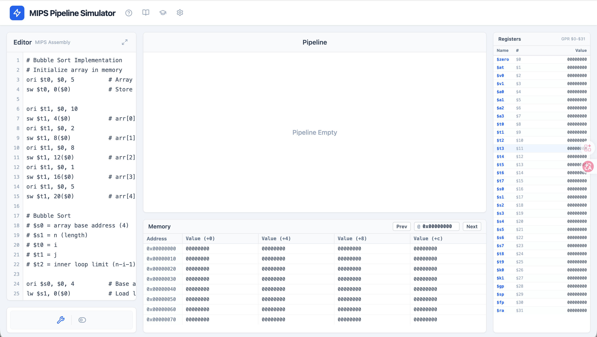
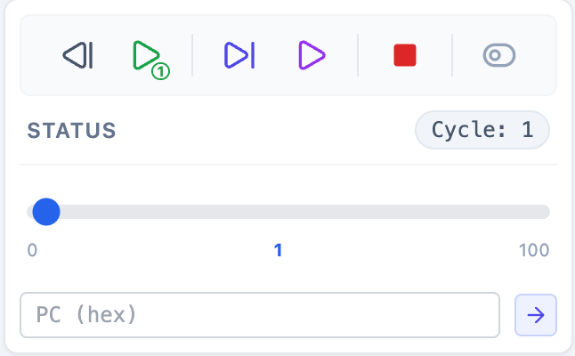
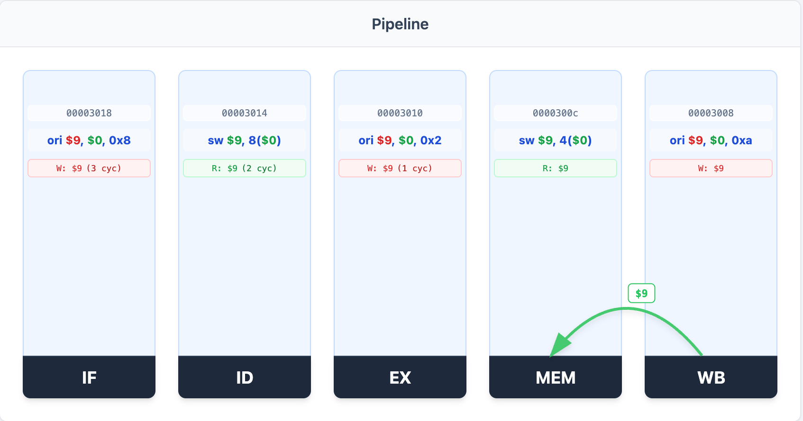
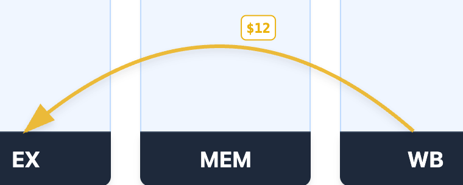
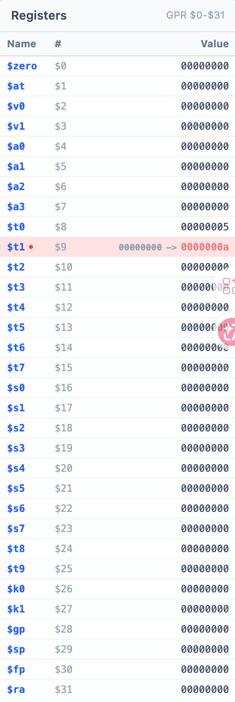
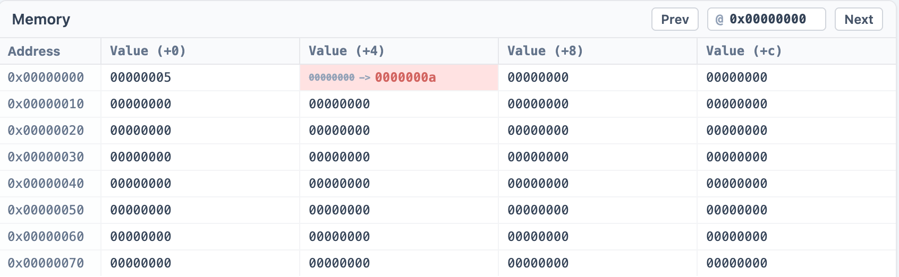

# MIPS Pipeline Simulator 使用指南

## 概览

MIPS Pipeline Simulator 是一个交互式的 MIPS 五级流水线 CPU 模拟器，用于学习和理解流水线处理器的工作原理。模拟器支持：

- **流水线可视化**：IF、ID、EX、MEM、WB
- **数据转发、暂停可视化**：显示流水线各级之间的数据转发路径/暂停逻辑
- **与Mars相同逻辑的控制**：支持逐周期执行和回退等，方便调试
- **寄存器与内存实时监控**：实时显示寄存器和内存的变化

### 界面布局

模拟器界面分为以下几个主要区域：

1. **左侧**：代码编辑器 + 控制面板
2. **中间**：流水线可视化 + 内存视图
3. **右侧**：寄存器视图
4. **顶部**：快捷键提示、功能按钮



---

## 代码编辑器

代码编辑器用于编写和加载 MIPS 汇编代码。

### 功能说明

- **语法高亮**：显示行号，当前执行行高亮
- **当前指令追踪**：正在执行的指令会被黄色高亮标记
- **自动滚动**：当代码执行时，编辑器会自动滚动到当前行
- **全屏模式**：点击右上角的全屏按钮可放大编辑器

### 使用方法

1. 在编辑器中输入 MIPS 汇编代码
2. 点击控制面板中的 **Assemble**  按钮(或F6)进行汇编
3. 汇编成功后，编辑器将锁定（只读），当前指令行会被高亮
4. 执行过程中，编辑器会自动跟踪当前执行的指令

### 示例代码

编辑器默认包含一个冒泡排序的实现示例：

```mips
# Bubble Sort Implementation
# Initialize array in memory
ori $t0, $0, 5          # Array length
sw $t0, 0($0)           # Store length at 0x0

ori $t1, $0, 10
sw $t1, 4($0)           # arr[0] = 10
# ... more initialization

outer_loop:
    # Bubble sort logic
    # ...
```

### 键盘快捷键

| 快捷键 | 功能 |
|--------|------|
| F6 | 汇编/加载代码 |

---

## 控制面板

控制面板提供模拟器的执行控制功能。



### 按钮功能

#### 汇编前

| 按钮 | 快捷键 | 说明 |
|------|--------|------|
| **Assemble** | F6 | 汇编当前代码并初始化模拟器 |

#### 汇编后

| 按钮 | 快捷键 | 说明 |
|------|--------|------|
| **Step Back** | F11 | 回退到上一个时钟周期 |
| **Step Forward** | F10 | 前进一个时钟周期 |
| **Continue** | F5 | 跳转到本次模拟已执行的最远位置 |
| **Run** | - | 连续运行直到程序结束 |
| **Stop** | Esc | 停止执行，重置状态 |

> 注：Continue按钮使用：当使用 Step Back 回退查看之前的周期，或使用周期滑块跳转到历史周期后，点击 Continue 可以快速跳回到模拟器已执行到的最远位置(即当次模拟的"最新"状态)

### 周期导航

- **周期滑块**：拖动滑块可以快速跳转到指定的时钟周期
- **周期计数器**：显示当前所处的时钟周期数

### 显示模式切换

控制面板右侧有一个模式切换按钮/：

- **简单模式**：显示剩余周期数
- **详细模式**：用于深入理解流水线时序

---

## 流水线

流水线可视化区域展示五级流水线的当前状态，是理解流水线工作原理的核心区域。



### 五级流水线阶段

| 阶段 | 名称 | 功能 |
|------|------|------|
| **IF** | Instruction Fetch | 从内存读取指令 |
| **ID** | Instruction Decode | 解析指令，读取寄存器 |
| **EX** | Execute | ALU 运算或地址计算 |
| **MEM** | Memory Access | 读取或写入内存 |
| **WB** | Write Back | 将结果写入寄存器 |

### 流水线阶段显示内容

每个流水线阶段显示以下信息：

1. **PC 地址**：当前指令的 PC 值（顶部小字）
2. **指令内容**：当前执行的指令（中间大字）
3. **写寄存器 (W)**：该指令将要写入的寄存器（红色标记）
4. **读寄存器 (R)**：该指令需要读取的寄存器（绿色标记）
5. **状态标记**：
   - **STALL**：流水线暂停（红色背景）
   - **BUBBLE**：流水线气泡（黄色背景）

### 数据转发可视化

模拟器会自动显示数据转发路径，使用不同颜色的曲线表示：

| 颜色 | 转发目标 | 说明 |
|------|----------|------|
| **蓝色** | → ID | 转发到译码阶段 |
| **黄色** | → EX | 转发到执行阶段 |
| **绿色** | → MEM | 转发到访存阶段 |

转发线上会标注被转发的寄存器编号


### 冒险处理说明

模拟器自动处理以下数据冒险：

1. **RAW冒险**：
   - 通过数据转发解决大部分 RAW 冒险
   - Load-Use 冒险会触发 STALL

2. **控制冒险**：
   - 分支指令会在 ID 阶段判断跳转条件
   - 使用延迟槽技术

---

## 内存与寄存器视图

### 寄存器视图

寄存器视图显示所有 32 个通用寄存器（GPR）的当前值。



#### 寄存器列表

| 编号 | 名称 | 用途 |
|------|------|------|
| $0 | $zero | 常量 0 |
| $1 | $at | 汇编器临时寄存器 |
| $2-$3 | $v0-$v1 | 函数返回值 |
| $4-$7 | $a0-$a3 | 函数参数 |
| $8-$15 | $t0-$t7 | 临时寄存器 |
| $16-$23 | $s0-$s7 | 保存寄存器 |
| $24-$25 | $t8-$t9 | 更多临时寄存器 |
| $26-$27 | $k0-$k1 | 内核保留 |
| $28 | $gp | 全局指针 |
| $29 | $sp | 栈指针 |
| $30 | $fp | 帧指针 |
| $31 | $ra | 返回地址 |

#### 显示说明

- **红色背景**：该寄存器在本周期被写入
- **变化动画**：显示值从旧值变为新值的过程
- **自动滚动**：当寄存器被写入时，视图会自动滚动到该寄存器

### 内存视图

内存视图显示内存中的数据内容，以十六进制格式呈现。



#### 功能说明

1. **地址导航**：
   - 在地址输入框中输入起始地址（十六进制）
   - 点击 **Prev** 向前翻页（-128 字节）
   - 点击 **Next** 向后翻页（+128 字节）

2. **数据显示**：
   - 每行显示 4 个字
   - 格式：地址 | +0 | +4 | +8 | +c

3. **变化标记**：
   - **红色背景**：该内存位置在本周期被写入
   - **变化动画**：显示值从旧值变为新值的过程

---

## 扩展功能

### 指令参考手册

点击顶部的书本图标可打开指令参考手册，包含：

1. **Tuse / Tnew 概念解释**：
   - **Tuse**：源操作数被使用的时刻（距离当前还需多少周期）
     - Tuse = 0：在 D 阶段使用
     - Tuse = 1：在 E 阶段使用
     - Tuse = 2：在 M 阶段使用
   - **Tnew**：结果产生的时刻（结果在哪个阶段准备好）
     - Tnew = E：在 E 阶段产生
     - Tnew = M：在 M 阶段产生
     - Tnew = W：在 W 阶段产生

2. **支持的指令列表**：
   - 算术指令：add, sub, addi 等
   - 逻辑指令：ori, and, or, lui 等
   - 访存指令：lw, sw 等
   - 分支跳转指令：beq, bne, j, jal, jr 等

### Quiz模式

点击顶部的学士帽图标可进入测验模式，用于测试对 Tuse/Tnew 的理解：

1. 系统会随机显示指令
2. 用户需要选择正确的 Tuse(rs)、Tuse(rt) 和 Tnew 值
3. 答对得分，答错显示正确答案
4. 完成所有题目后显示总分

---

## 使用流程

1. **编写代码**：在编辑器中输入 MIPS 汇编代码
2. **汇编加载**：点击 Assemble 按钮或按 F6
3. **单步执行**：使用 Step Forward 按钮或按 F10 逐周期执行
4. **观察流水线**：观察各级流水线的变化和数据转发
5. **检查状态**：查看寄存器和内存的变化
6. **回退调试**：使用 Step Back 按钮或按 F11 回退分析
7. **快速定位**：使用周期滑块或 PC 跳转快速定位到特定时刻

---